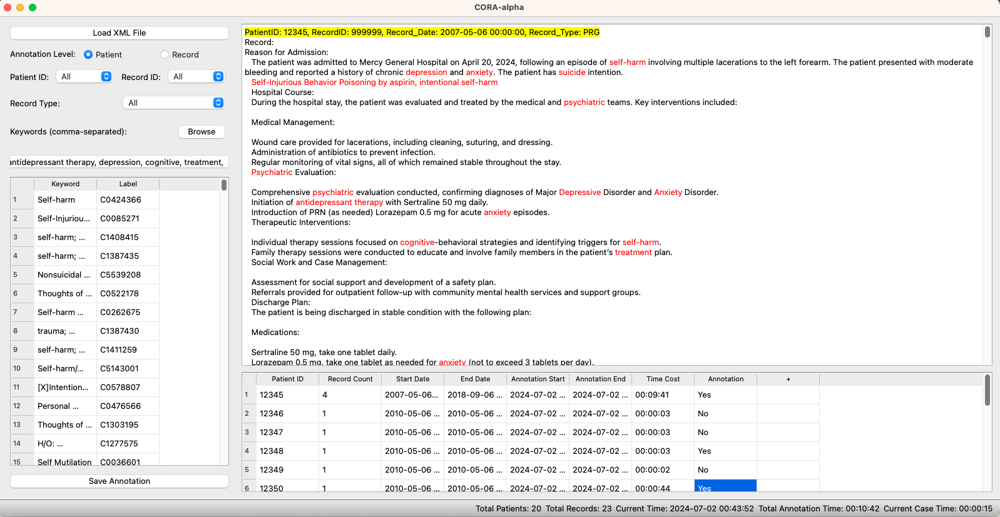

# 

--------------------------------------------------------------------------------

CORA: Clinical Optimized Record Annotation tool====

About:
====
CORA is an efficient annotation tool to optimize manual annotation process of clinical records. 

This GUI annotation tool is developed with PyQt5 package in Python. 

System required: Python 3.6 or above

Author: [Jie Yang](https://jiesutd.github.io).

Interface:
====
CORA provides an annotation UI.
* Annotator Interface:
 

 Updating...
====
* 2024-June-25, project launched.